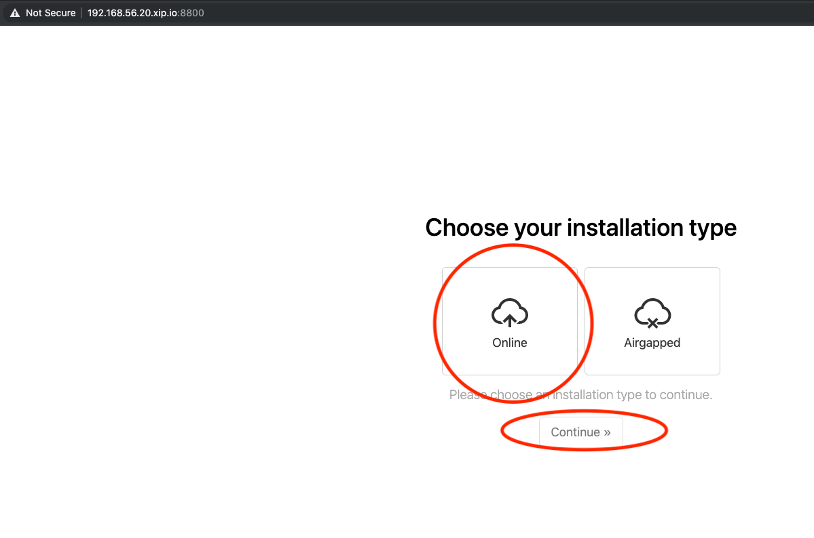

# ptfe-vagrant-installation
PTFE demo installation with vagrant box

# Pre-requisites

- install [git](https://git-scm.com/downloads)
- install [Terraform](https://learn.hashicorp.com/terraform/getting-started/install.html)
- [TFE](https://www.terraform.io/docs/enterprise/index.html)
- License file (provided by HashiCorp)

## installation options
- online
- Airgapped

# usage
```bash
git clone git@github.com:andrewpopa/ptfe-vagrant-installation.git
cd ptfe-vagrant-installation
vagrant up
vagrant ssh
```

## execute the installer directly
```bash 
curl https://install.terraform.io/ptfe/stable | sudo bash
```
## in our case we have `vagrant` box running with hard coded ip we select it

```bash
Determining local address
The installer was unable to automatically detect the private IP address of this machine.
Please choose one of the following network interfaces:
[0] enp0s3	10.0.2.15
[1] enp0s8	192.168.50.20
[2] docker0	172.17.0.1
Enter desired number (0-2): 1
```

rest of the configuration need to be done via web [webui](https://192.168.56.20.xip.io:8800/). you should use [DNS](http://xip.io) for configuration 

## use DNS for configuration and Self Signed Certificate


## upload license provided by HashiCorp


## choose installation mode - Online in our case


## create password


## make sure you passed all preflight checks


## encryption password and installation mode - demo in our case


## once configuration is done. do a snapshot via admin [webui](https://192.168.56.20.xip.io:8800/)


# restore procedure

## back to terminal and execute script
```bash
cd /vagrant
sudo bash delete_all.sh
```

this script is going to stop and remove PTFE application from you machine. it will also copy snapshot to separate location

## after PTFE doesn't exist proceed with fresh [install](#execute-the-installer-directly) 

## once the installation is done repeat the step with [dns and self-signed-certificate](#use-DNS-for-configuration-and-Self-Signed-Certificate)

## go with restore procedure


## browse snapshots and click restore


## use your old password


## repeat preflight [step](#make-sure-you-passed-all-preflight-checks)

## select DB snapshot


## see restore status


go to [dashboard](https://192.168.56.20.xip.io:8800/dashboard) and check when PTFE application will be up and running. similar to [step](#once-configuration-is-done-do-a-snapshot-via-admin-webui)

## once application is running. click open to create new account


# PTFE components

## main components
- replicated console
- postgres db (prod: external db)
- s3 compatible storage (prod: external s3 compatible)
- ptfe application

## to restore we need
- replicated console
- snapshot
- s3 compatible storage
- postgres db


Enjoy!