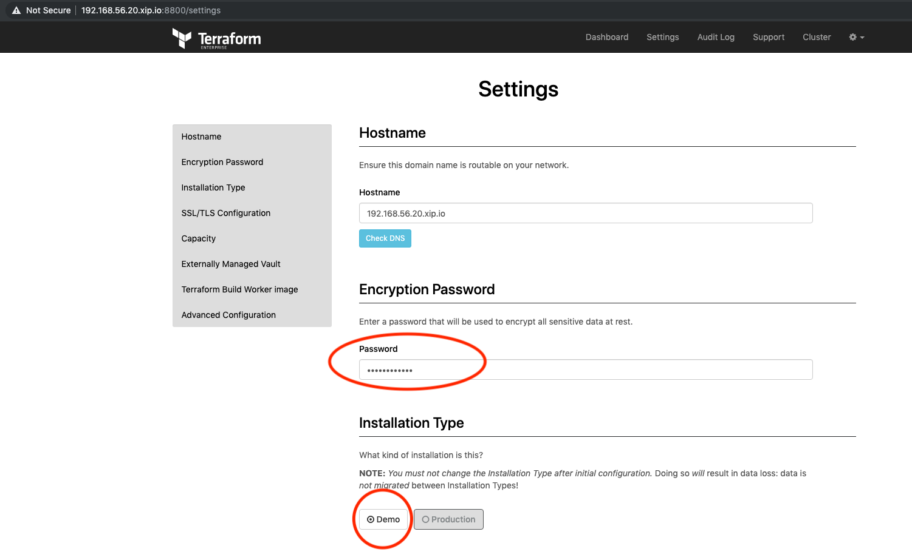
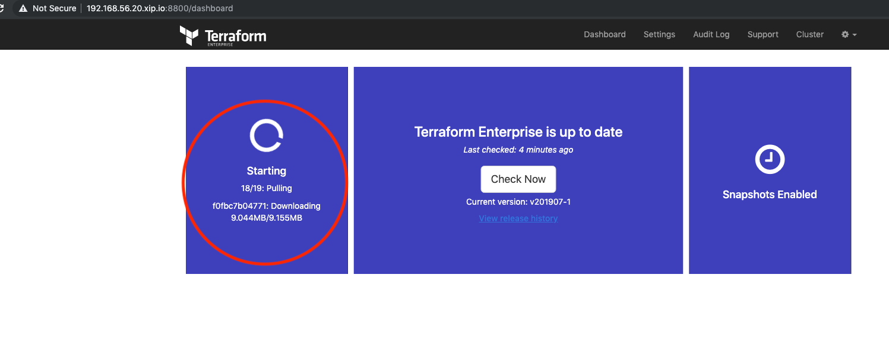

# ptfe-vagrant-installation
PTFE demo installation 

This repo provides a Vagrantfile to create a VM to perform a PTFE installation and instructions to performa an install and restore.

## Description

- vagrant box with 4gb of RAM
- dns record `192.168.56.20.xip.io` as FQDN
- We are going to do the following steps:
  - install PTFE application
  - create a snapshot of the data
  - destroy PTFE application
  - restore PTFE application using snapshot data

## Pre-requirements

- install [git](https://git-scm.com/downloads)
- [Virtualbox](https://www.virtualbox.org/wiki/Downloads)
- [Vagrant](https://www.vagrantup.com/intro/getting-started/install.html)
- [TFE](https://www.terraform.io/docs/enterprise/index.html)
- TFE License file (provided by HashiCorp)

## Create VM

- clone repository
- change directory
- start vm
- ssh into vm

```bash
git clone git@github.com:andrewpopa/ptfe-vagrant-installation.git
cd ptfe-vagrant-installation
vagrant up
vagrant ssh
```

## execute the installer

run the installation script after login to vagrant box

```bash 
curl https://install.terraform.io/ptfe/stable | sudo bash
```
## specify lan network

choose the interface with the lan ip `192.168.56.20`

```bash
Determining local address
The installer was unable to automatically detect the private IP address of this machine.
Please choose one of the following network interfaces:
[0] enp0s3	10.0.2.15
[1] enp0s8	192.168.50.20
[2] docker0	172.17.0.1
Enter desired number (0-2): 1
```

This is where command line configuration end. The rest of configuration is need to be done via web interface.

## use DNS for configuration and Self Signed Certificate

- set fqdn for this installation, use `192.168.56.20.xip.io`
- click on **self-signed cert**


## upload license provided by HashiCorp

- click on choose license
- choose your file with licence from your pc


## choose installation mode

- click on online
- click on continue


## secure admin console

- write a password for the replicated console
> we will use this password later


## review preflight checks

- preflight should be all green
- click on continue


## encryption password and installation mode - demo in our case

add password for encryption, choose **Demo** mode of installation and don't forget to click **Save** and the end of the page (this information is not in screenshot :) )



## loading the configuration

wait until all components will be loaded



## once configuration is done. do a snapshot via admin [webui](https://192.168.56.20.xip.io:8800/)

click to - **Start snapshot** to do it

click to - **Open** so you can go to PTFE application


until that moment the installation of PTFE is done. you can proceed and start working with it

# restore procedure

## execute custom script

go back to terminal and execute script. this script is going to stop and remove PTFE application from you machine. prior that will create snapshot and move it to separate location

```bash
cd /vagrant
sudo bash delete_all.sh
```

## re-install application

run cli installer of the application
```bash 
curl https://install.terraform.io/ptfe/stable | sudo bash
```

## configure dns with self-signed cert

do the same step as on installation


## go with restore procedure

choose to restore application from snapshot


## browse snapshots and click restore

click on **browse snapshots** apllication will scan for it and click **Restore**


## use your old password

magic password which you created during the installation part, do you remember? :-)


## repeat preflight step

pass all preflight checks, *again*...


## select DB snapshot

see the version available to restore and click **Restore**


## see restore status

after the restoration point, application will redirect you to **cluster** page with current status


## check the application status
go to [dashboard](https://192.168.56.20.xip.io:8800/dashboard) and check when PTFE application will be up and running. Once it's running click to **Open** you'll be redirected to new page with a possibility to create a new user.


## new user account

create a new user account to login to PTFE. Once you have it, you can create new projects.


# PTFE components

## main components
- replicated console
- postgres db (prod: external db)
- s3 compatible storage (prod: external s3 compatible)
- ptfe application

## to restore we need
- replicated console
- snapshot
- s3 compatible storage
- postgres db


Enjoy!
